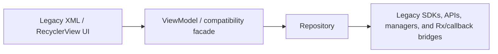
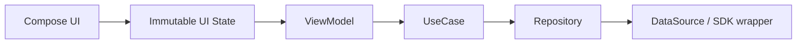

# MuseFlow Android


**Language**: [中文](README.md) | English

MuseFlow Android is a public-slim Android music app snapshot. It keeps the runnable core music, discovery, feed, chat, download, and lyric paths while documenting an in-place modernization from a Java/XML codebase toward Kotlin, Media3, ViewModel state, UseCase/Repository boundaries, and eventually Compose.

The repository is intentionally scoped: frozen commercial/demo integrations were removed from the public branch, and modernization work focuses on the user-facing chains that matter most for architecture and performance.

## Contents

- [Project Layout](#project-layout)
- [Scope](#scope)
- [Current Status](#current-status)
- [Architecture Direction](#architecture-direction)
- [Tech Stack](#tech-stack)
- [Getting Started](#getting-started)
- [Build And Run](#build-and-run)
- [Verification](#verification)
- [Documentation](#documentation)
- [Roadmap](#roadmap)
- [Contributing](#contributing)
- [License](#license)

## Project Layout

The Android project lives under:

```text
code/video/MyCloudMusicAndroidJava/
```

Key directories:

```text
.
`-- code/video/MyCloudMusicAndroidJava/
    |-- app/                         # Main Android application
    |-- docs/modernization/          # Scope, target stack, progress, and handoff docs
    |-- LRecyclerview/               # Legacy RecyclerView support module
    |-- glidepalette/                # Palette helper module
    |-- super-j/                     # Shared legacy utility module
    |-- build.gradle                 # Android root build configuration
    |-- common.gradle                # Shared Android module configuration
    `-- settings.gradle              # Module registry and repositories
```

## Scope

The modernization plan focuses on five retained chains:

- Music playback: player screen, queue, playback service, notifications, lyrics, and widget-facing compatibility.
- Chat IM: conversation list, chat detail, history loading, text/image message paths, and retained navigation.
- Feed publishing: image selection, compression, upload, feed creation, and feed list refresh.
- Downloads: downloading/downloaded lists, pause/resume/delete operations, and progress refresh.
- Discovery and feed lists: home sections, banners, song/sheet entries, feed cards, and scrolling.

The public-slim branch removes or stubs frozen areas such as mall/order/payment/address/profile/settings/search/scan/video/web/push/splash/guide and heavy third-party SDK integrations that are not needed for the retained modernization surface.

## Current Status

According to the modernization docs in this branch:

- Kotlin, Compose compilation, Media3, Coroutines, WorkManager, DataStore, Paging, and Hilt baselines are present.
- `:app:assembleDevDebug` and unit tests passed in the public-slim handoff checkpoint.
- Playback is bridged toward Media3 while preserving legacy manager-style compatibility.
- Discovery, download, feed, chat, player, and lyric boundaries have been progressively migrated toward Kotlin.
- Legacy XML/ViewBinding screens still exist and are expected during the transition.
- Deep device smoke testing remains a separate acceptance step, especially across playback, chat, feed publishing, downloads, and discovery/feed lists.

## Architecture Direction

Current migration shape:



Target direction for retained chains:



The compatibility rule is simple: keep old Java/XML entry points runnable while replacing selected internals behind stable Kotlin boundaries.

## Tech Stack

- Language: Java and Kotlin, with new selected-chain work favoring Kotlin.
- UI: legacy XML/ViewBinding today, Compose enabled for gradual migration.
- State: ViewModel and immutable UI state direction for new code.
- Async: RxJava/EventBus in legacy areas; Coroutines/Flow direction for new boundaries.
- Playback: Media3/MediaSession direction behind legacy manager compatibility.
- Dependency injection: Hilt baseline.
- Build: Android Gradle Plugin 8.2.0, Kotlin 1.9.22, compileSdk 34, targetSdk 33, minSdk 23.

## Getting Started

### Prerequisites

- Android Studio with JDK 17.
- Android SDK 34.
- A device or emulator running Android 6.0 or newer.
- Network access to Google Maven, Maven Central, JitPack, and RongCloud Maven.

### Clone

```bash
git clone https://github.com/lemma42796/museflow-android.git
cd museflow-android/code/video/MyCloudMusicAndroidJava
```

### Local Configuration

The app build expects Android signing values in `keystore.properties`:

```properties
storeFile=config/your-debug-or-release-key.jks
storePassword=your-store-password
keyAlias=your-key-alias
keyPassword=your-key-password
```

Use your own local signing material and keep private credentials out of version control.

## Build And Run

From `code/video/MyCloudMusicAndroidJava`:

```bash
./gradlew :app:assembleDevDebug
```

Install the generated APK:

```bash
adb install -r app/build/outputs/apk/dev/debug/app-dev-debug.apk
```

Other useful variants:

```bash
./gradlew :app:assembleLocalDebug
./gradlew :app:assembleProdDebug
```

## Verification

Fast local checks:

```bash
git diff --check
./gradlew :app:assembleDevDebug
./gradlew :app:testDevDebugUnitTest
```

Manual smoke testing should prioritize:

- App launch and session preservation.
- Playback: play, pause, seek, next/previous, background notification, widget, lyrics.
- Chat: conversation list, chat entry, history loading, text send, image send entry.
- Feed: list refresh, image selection, compression/upload path, publish completion.
- Downloads: downloading/downloaded tabs, pause/resume/delete, progress refresh.
- Discovery/feed: banners, modules, song/sheet entries, list scroll, retained detail routes.

## Documentation

The modernization docs are the source of truth for scope and progress:

- [Modernization overview](code/video/MyCloudMusicAndroidJava/docs/modernization/README.md)
- [Execution plan and progress](code/video/MyCloudMusicAndroidJava/docs/modernization/execution-plan.md)
- [Target Android stack](code/video/MyCloudMusicAndroidJava/docs/modernization/target-stack.md)
- [Selected-chain module plans](code/video/MyCloudMusicAndroidJava/docs/modernization/module-plans.md)
- [Freeze strategy and acceptance rules](code/video/MyCloudMusicAndroidJava/docs/modernization/freeze-and-acceptance.md)
- [Public-slim handoff](code/video/MyCloudMusicAndroidJava/docs/modernization/public-slim-progress.md)

## Roadmap

1. Finish deep manual smoke testing for the five retained chains.
2. Continue moving retained chain state behind ViewModel, UseCase, and Repository boundaries.
3. Replace RxJava/EventBus only where the retained chains already touch the boundary.
4. Migrate selected screens to Compose one page or component at a time.
5. Split stable boundaries into clearer core and feature modules after behavior is proven.

## Contributing

This repository favors narrow, behavior-preserving changes:

- Keep changes inside retained modernization chains unless a small bridge is required.
- Preserve legacy Java/XML entry points while migration is in progress.
- Avoid broad formatting, package moves, or style-only cleanup in frozen modules.
- Update the modernization docs when a milestone, risk, or handoff point changes.
- Run `git diff --check` and the dev debug build before publishing code changes when validation is in scope.

## License

No open-source license file has been added yet. Choose and add a `LICENSE` file before distributing this project as an open-source package.
