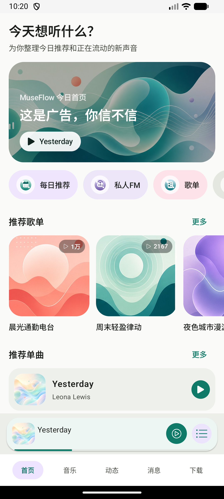
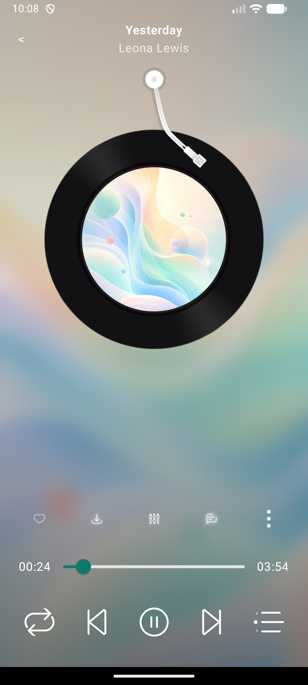

# MuseFlow Android


**Language**: [中文](README.md) | English

MuseFlow Android is a mobile music and community app covering playback, discovery, feed publishing, chat conversations, offline downloads, lyrics, and home-screen widgets. The project focuses on complex Android app paths that matter in production-like work: media playback state, list refreshes, image handling, background services, device-side performance, and maintainable page state.

## Contents

- [Highlights](#highlights)
- [Screenshots](#screenshots)
- [Features](#features)
- [Engineering](#engineering)
- [Verification Notes](#verification-notes)
- [Project Structure](#project-structure)
- [Getting Started](#getting-started)
- [Build And Run](#build-and-run)
- [Validation](#validation)
- [Roadmap](#roadmap)
- [License](#license)

## Highlights

- Complete music playback path: Media3 ExoPlayer, MediaSessionService, system media controls, play/pause, seek, previous/next, background notification, queue state, lyrics, and widget integration.
- Product-level flows: discovery recommendations, playlists, song entry points, feed list, image selection/upload, chat conversations, download management, and local music scanning can be verified on device.
- Clear state boundaries: main screens follow a `ViewModel -> UseCase -> Repository` structure, with UI rendered from state streams and feature logic kept outside the page layer.
- Compose-first UI: the main shell, discovery, feed, chat, downloads, sheet detail, comments, local music, lyric selection, and player-facing screens use Compose, while complex lyric and record views are reused through stable AndroidView boundaries.
- Repeatable performance evidence: the project includes Macrobenchmark, Baseline Profile, Perfetto trace sections, and benchmark-only fixtures for startup, home scrolling, opening the player, playback controls, lyric dragging, and download-list refresh.
- Device compatibility work: the build has first-pass native packaging alignment for Android 16 KB page-size devices, alongside local signing and multi-environment build variants.

## Screenshots

<p>
  
  
</p>

## Features

- Music playback: playback controls, queue, seeking, loop mode, background notification, lyrics, floating lyrics, and home-screen widget.
- Discovery: recommendation banner, playlists, songs, quick actions, home scrolling, and opening the player from discovery.
- Community feed: feed list, image preview, image selection, image compression/upload, publishing, and interaction entry points.
- Chat: conversation list, chat detail, history messages, text/image messages, and unread state.
- Downloads: downloading/downloaded tabs, progress display, pause, resume, delete, and batched refresh behavior.
- Local music: local song scanning, song list, playback, and lyric-related entry points.

## Engineering

- Language and UI: Kotlin, Jetpack Compose, Material 3, AndroidView, Glance App Widget
- App structure: ViewModel, UseCase, Repository, StateFlow, SharedFlow
- Media playback: Media3 ExoPlayer, MediaSessionService, system media notification, playback queue state sync
- Background and data: WorkManager, DataStore, Paging, Retrofit, OkHttp, Hilt
- Performance tooling: Macrobenchmark, Baseline Profile, Perfetto trace, custom trace sections
- Build: Android Gradle Plugin 8.5.2, Gradle 8.7, Kotlin 1.9.22, compileSdk 34, targetSdk 33, minSdk 23

## Verification Notes

The numbers below come from local device verification recorded in this repository. They show repeatable measurement coverage rather than a universal performance guarantee across all devices.

- `:app:assembleDevDebug` builds the debug APK.
- Macrobenchmark covers cold startup, home scrolling, opening the player, playback controls, lyric panel display, lyric dragging, and download-list refresh.
- On Redmi `25060RK16C`, cold startup median after Baseline Profile integration is `302.5 ms`.
- On the same device, player first-screen `frameDurationCpuMs` P99 changed from `26.9 ms` to `18.7 ms`, about a `30.5%` improvement.
- Home recommendation scroll retest: `frameDurationCpuMs` P99 `6.4 ms`, `frameOverrunMs` P99 `-1.4 ms`.
- Lyric dragging retest: `frameDurationCpuMs` P99 `11.5 ms`, `frameOverrunMs` P99 `4.3 ms`.
- Download-list refresh no-input benchmark: `frameDurationCpuMs` P99 `15.9 ms`, `frameOverrunMs` P99 `8.3 ms`.
- Android 16 KB page-size build-side alignment has first-pass handling; install, launch, and fatal-log checks passed on a regular emulator.

## Project Structure

The Android project lives under:

```text
code/video/MyCloudMusicAndroidJava/
```

Key directories:

```text
.
`-- code/video/MyCloudMusicAndroidJava/
    |-- app/                         # Main Android application
    |-- macrobenchmark/              # Performance tests for startup, playback, lyrics, and downloads
    |-- docs/                        # Engineering notes and verification records
    |-- LRecyclerview/               # RecyclerView support module
    |-- glidepalette/                # Palette helper module
    |-- super-j/                     # Shared utility module
    |-- build.gradle                 # Android root build configuration
    |-- common.gradle                # Shared Android module configuration
    `-- settings.gradle              # Module registry and repositories
```

## Getting Started

### Prerequisites

- Android Studio with JDK 17
- Android SDK 34
- A device or emulator running Android 6.0 or newer
- Network access to Google Maven, Maven Central, JitPack, and RongCloud Maven

### Clone

```bash
git clone https://github.com/lemma42796/museflow-android.git
cd museflow-android/code/video/MyCloudMusicAndroidJava
```

### Local Configuration

The app build expects Android signing values in `keystore.properties`:

```properties
storeFile=config/your-debug-or-release-key.jks
storePassword=your-store-password
keyAlias=your-key-alias
keyPassword=your-key-password
```

Use your own local signing material and keep private credentials out of version control.

## Build And Run

From `code/video/MyCloudMusicAndroidJava`:

```bash
./gradlew :app:assembleDevDebug
```

Install the generated APK:

```bash
adb install -r app/build/outputs/apk/dev/debug/app-dev-debug.apk
```

Other useful variants:

```bash
./gradlew :app:assembleLocalDebug
./gradlew :app:assembleProdDebug
```

## Validation

Fast local checks:

```bash
git diff --check
./gradlew :app:assembleDevDebug
```

Performance command examples:

```bash
./gradlew :app:compileDevBenchmarkKotlin :macrobenchmark:compileDevBenchmarkKotlin
./gradlew :macrobenchmark:connectedDevBenchmarkAndroidTest
```

Recommended manual verification paths:

- App launch and home state
- Home scrolling, opening the player from discovery, play/pause, seek, previous/next, and background notification
- Lyric panel, lyric dragging, floating lyrics, and widget controls
- Feed list, image selection, image upload, and publishing flow
- Conversation list, chat detail, history messages, and message entry points
- Downloading/downloaded lists, pause, resume, delete, and progress display

## Roadmap

- Add screenshots for home, player, feed/chat, and download management.
- Add a demo video and more complete device verification notes.
- Continue performance retesting for playback, lyrics, download refresh, and image handling.
- Add an open-source license and contribution guidelines.

## License

No open-source license file has been added yet. Choose and add a `LICENSE` file before distributing this project as an open-source package.
