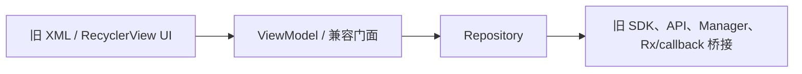
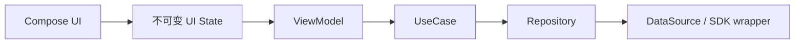

# MuseFlow Android


**语言**：中文 | [English](README.en.md)

MuseFlow Android 是一个面向公开展示的 Android 音乐应用重构快照。这个仓库保留了音乐播放、发现页、动态、聊天、下载和歌词等核心链路，并记录了一个真实 Java/XML 老项目向 Kotlin、Media3、ViewModel 状态管理、UseCase/Repository 分层以及后续 Compose UI 渐进迁移的过程。

当前仓库是 public-slim 版本：与核心重构无关的商业/演示集成已经被移除或替换为轻量壳代码，重构范围集中在最有架构价值和性能优化价值的用户链路上。

## 目录

- [项目结构](#项目结构)
- [重构范围](#重构范围)
- [当前状态](#当前状态)
- [架构方向](#架构方向)
- [技术栈](#技术栈)
- [快速开始](#快速开始)
- [构建和运行](#构建和运行)
- [验证方式](#验证方式)
- [项目文档](#项目文档)
- [路线图](#路线图)
- [贡献说明](#贡献说明)
- [许可证](#许可证)

## 项目结构

Android 工程位于：

```text
code/video/MyCloudMusicAndroidJava/
```

关键目录：

```text
.
`-- code/video/MyCloudMusicAndroidJava/
    |-- app/                         # Android 主应用
    |-- docs/modernization/          # 范围、技术栈、进度和交接文档
    |-- LRecyclerview/               # 旧 RecyclerView 支撑模块
    |-- glidepalette/                # 调色板辅助模块
    |-- super-j/                     # 旧通用工具模块
    |-- build.gradle                 # Android 根构建配置
    |-- common.gradle                # 共享 Android 模块配置
    `-- settings.gradle              # 模块和仓库配置
```

## 重构范围

现代化计划聚焦五条保留链路：

- 音乐播放：播放器页面、播放队列、播放服务、通知、歌词和 Widget 兼容边界。
- 聊天 IM：会话列表、聊天详情、历史消息加载、文本/图片消息路径和保留导航。
- 动态发布：图片选择、压缩、上传、动态创建和动态列表刷新。
- 下载：下载中/已下载列表、暂停/继续/删除操作和进度刷新。
- 发现页和信息流：首页模块、Banner、歌曲/歌单入口、动态卡片和列表滚动。

public-slim 分支已经移除或 stub 掉商城、订单、支付、地址、资料、设置、搜索、扫码、视频、Web、推送、启动页、引导页等冻结功能，以及与当前核心重构面无关的重型第三方 SDK 集成。

## 当前状态

根据当前分支内的现代化文档：

- Kotlin、Compose 编译能力、Media3、Coroutines、WorkManager、DataStore、Paging 和 Hilt 基线已接入。
- public-slim 交接点记录中，`:app:assembleDevDebug` 和单元测试曾通过。
- 播放链路已经向 Media3 桥接，同时保留旧 Manager 风格兼容入口。
- 发现页、下载、动态、聊天、播放器和歌词等边界已逐步迁移到 Kotlin。
- 旧 XML/ViewBinding 页面仍然存在，这是渐进迁移期的预期状态。
- 深度设备端冒烟仍是独立验收项，重点覆盖播放、聊天、动态发布、下载、发现页和信息流。

## 架构方向

当前迁移形态：



目标方向：



迁移原则：旧 Java/XML 入口继续可运行，选中链路的内部实现逐步替换为稳定的 Kotlin 边界。

## 技术栈

- 语言：Java + Kotlin，新重构代码优先 Kotlin。
- UI：当前保留 XML/ViewBinding，Compose 已开启用于渐进迁移。
- 状态管理：新代码方向为 ViewModel + 不可变 UI State。
- 异步：旧代码仍有 RxJava/EventBus，新边界逐步转向 Coroutines/Flow。
- 播放：Media3/MediaSession 方向，外层保留旧 Manager 兼容入口。
- 依赖注入：Hilt 基线。
- 构建：Android Gradle Plugin 8.2.0、Kotlin 1.9.22、compileSdk 34、targetSdk 33、minSdk 23。

## 快速开始

### 环境要求

- Android Studio，使用 JDK 17。
- Android SDK 34。
- Android 6.0 或更高版本的真机/模拟器。
- 能访问 Google Maven、Maven Central、JitPack 和 RongCloud Maven。

### 克隆仓库

```bash
git clone https://github.com/lemma42796/museflow-android.git
cd museflow-android/code/video/MyCloudMusicAndroidJava
```

### 本地配置

应用构建需要在 `keystore.properties` 中提供签名配置：

```properties
storeFile=config/your-debug-or-release-key.jks
storePassword=your-store-password
keyAlias=your-key-alias
keyPassword=your-key-password
```

请使用你自己的本地签名材料，并确保私有凭据不进入版本控制。

## 构建和运行

在 `code/video/MyCloudMusicAndroidJava` 目录执行：

```bash
./gradlew :app:assembleDevDebug
```

安装生成的 APK：

```bash
adb install -r app/build/outputs/apk/dev/debug/app-dev-debug.apk
```

其他可用构建变体：

```bash
./gradlew :app:assembleLocalDebug
./gradlew :app:assembleProdDebug
```

## 验证方式

快速本地检查：

```bash
git diff --check
./gradlew :app:assembleDevDebug
./gradlew :app:testDevDebugUnitTest
```

人工冒烟优先覆盖：

- App 启动和 Session 保留。
- 播放：播放、暂停、拖动、上一首/下一首、后台通知、Widget、歌词。
- 聊天：会话列表、聊天入口、历史消息加载、文本发送、图片发送入口。
- 动态：列表刷新、图片选择、压缩/上传路径、发布完成。
- 下载：下载中/已下载 Tab、暂停/继续/删除、进度刷新。
- 发现页/信息流：Banner、模块、歌曲/歌单入口、列表滚动和保留详情路由。

## 项目文档

现代化文档是范围和进度的事实来源：

- [现代化总纲](code/video/MyCloudMusicAndroidJava/docs/modernization/README.md)
- [执行计划和进度](code/video/MyCloudMusicAndroidJava/docs/modernization/execution-plan.md)
- [目标 Android 技术栈](code/video/MyCloudMusicAndroidJava/docs/modernization/target-stack.md)
- [选中链路方案](code/video/MyCloudMusicAndroidJava/docs/modernization/module-plans.md)
- [冻结策略和验收规则](code/video/MyCloudMusicAndroidJava/docs/modernization/freeze-and-acceptance.md)
- [public-slim 交接记录](code/video/MyCloudMusicAndroidJava/docs/modernization/public-slim-progress.md)

## 路线图

1. 完成五条保留链路的深度人工冒烟。
2. 继续把保留链路状态收敛到 ViewModel、UseCase 和 Repository 边界。
3. 只在保留链路触达的边界逐步替换 RxJava/EventBus。
4. 按页面或组件逐步迁移到 Compose。
5. 行为稳定后，再拆分更清晰的 core 和 feature 模块。

## 贡献说明

本仓库偏向小范围、保行为的改动：

- 改动优先限制在保留的现代化链路内，除非需要很薄的兼容桥接。
- 迁移期间保留旧 Java/XML 入口。
- 避免对冻结模块做大范围格式化、包移动或纯样式清理。
- 当里程碑、风险或交接点变化时，同步更新现代化文档。
- 如果本次改动需要验证，发布前至少运行 `git diff --check` 和 dev debug 构建。

## 许可证

当前尚未加入开源许可证文件。正式作为开源项目分发前，请先选择许可证并添加 `LICENSE` 文件。
